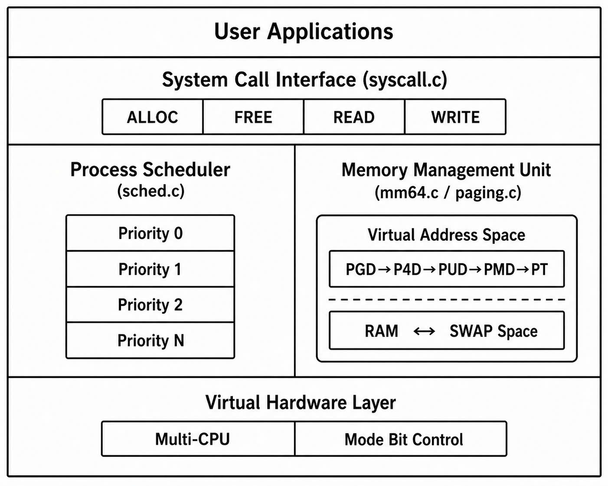
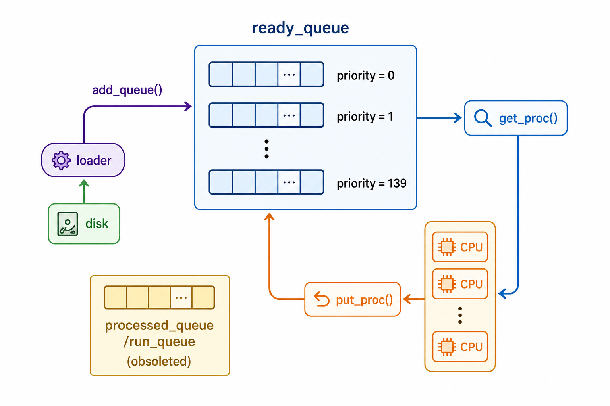
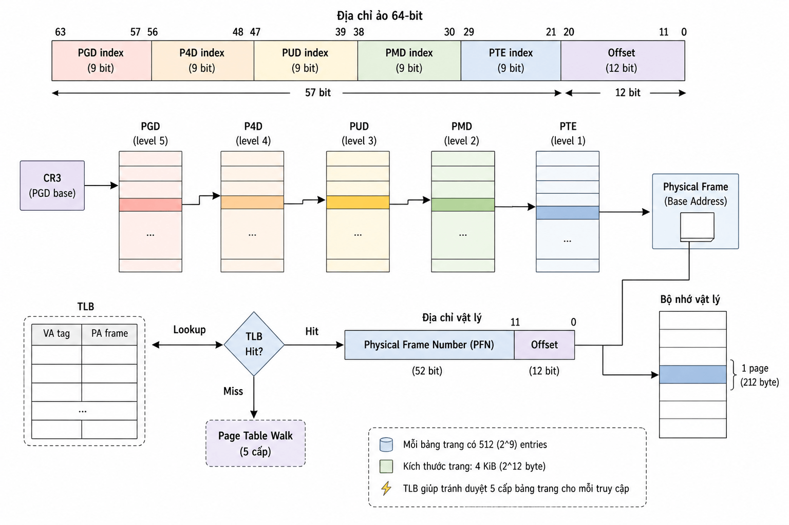
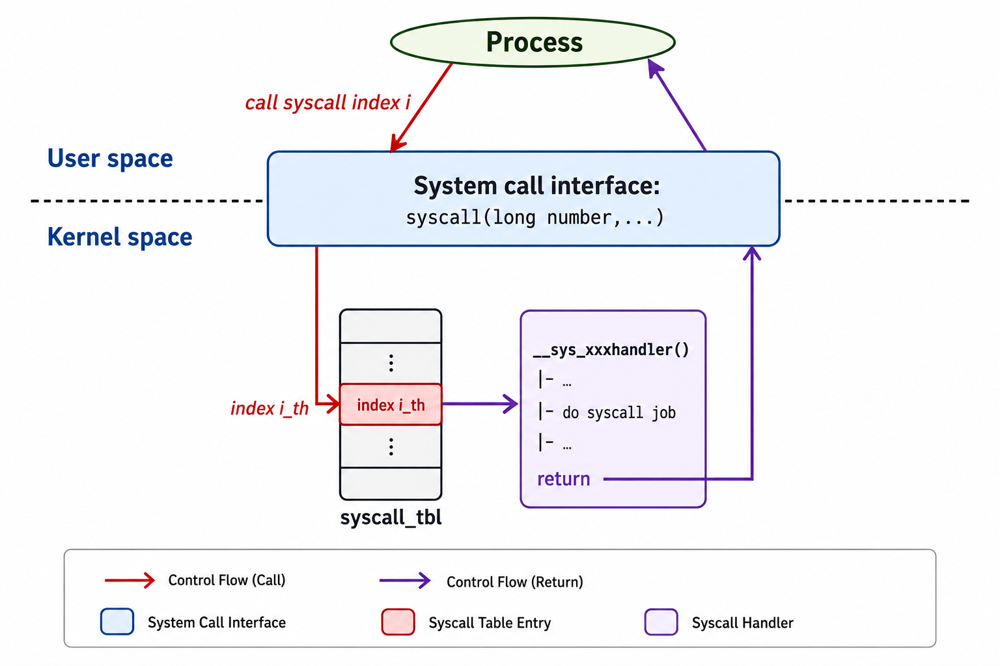

# ossim_caitoa
Simulation of a Multi-tasking Operating System focusing on Multi-level Queue Scheduling, 64-bit Paging-based Virtual Memory Management, and System Call Interfaces. Built as part of the Operating Systems (CO2018) course at HCMUT.


<div align="center">


# 🖥️ Simple Operating System Simulation

**A modular operating system simulator featuring process scheduling, virtual memory management, and kernel-mode system calls.**

*CO2018 — Operating Systems | Ho Chi Minh City University of Technology (HCMUT)*
*Linus_Newbies — Faculty of Computer Science & Engineering*

---

</div>

## 📖 Table of Contents

- [Overview](#-overview)
- [Architecture](#-architecture)
- [Key Features](#-key-features)
  - [Process Scheduler](#1-process-scheduler--multi-level-queue)
  - [Virtual Memory Management](#2-virtual-memory-management)
  - [Kernel Interface & System Calls](#3-kernel-interface--system-calls)
- [Project Structure](#-project-structure)
- [Getting Started](#-getting-started)
- [Continuous Integration (CI)](#️-continuous-integration-ci)
- [Team](#-team)
- [License](#-license)

---

## 📌 Overview

This project simulates the core components of a multitasking operating system, built as part of the **CO2018 - Operating Systems** course at HCMUT. The simulation models three major subsystems:

| Module | Description |
|---|---|
| **Process Scheduling** | Multi-Level Queue (MLQ) inspired by the Linux kernel |
| **Memory Management** | 5-level paging with swap support and segmentation |
| **Kernel Interface** | Dual-mode system calls with safe user-kernel data transfer |

The system is designed to run on **virtual hardware** supporting multiple CPUs and **dual-mode operation** (User Mode / Kernel Mode).

---

## 🏛️ Architecture

The OS manages two virtual resources — CPU(s) and RAM — through a **Scheduler/Dispatcher** and a **Virtual Memory Engine**. A hardware-supported mode bit enforces strict separation between user-mode and kernel-mode execution, preventing unauthorized access to privileged resources.

<p align="center">
  
</p>

---

## 🚀 Key Features

### 1. Process Scheduler — Multi-Level Queue

Implements a **Multi-Level Queue (MLQ)** scheduling policy modelled after the Linux kernel scheduler.

- **Priority Levels:** Configurable up to `MAX_PRIO` priority queues.
- **Time Slicing:** Round-robin execution within each priority level using a fixed time quantum.
- **Slot Allocation:** CPU slots per queue are computed as:

`slots = MAX_PRIO - priority`


Higher-priority processes receive more CPU time, ensuring responsiveness-critical tasks are handled first.

<p align="center">
  
</p>

---

### 2. Virtual Memory Management

A comprehensive **paging-based** memory system providing full isolation of process address spaces.

#### Address Space

| Scheme | Details |
|---|---|
| **Address Width** | 64-bit |
| **Paging Levels** | 5-level: `PGD → P4D → PUD → PMD → PT` |
| **Max Virtual Memory** | Up to **128 PiB** per process |

#### Components

- **Segmentation + Paging:** Memory areas (`vm_area_struct`) map contiguous virtual regions to discrete physical frames.
- **Swapping Mechanism:** A page-replacement policy moves pages between **RAM** and **SWAP** storage when physical memory is under pressure.

The diagram below shows how a virtual address is decomposed and walked through each level of the page-table hierarchy to resolve a physical frame:

<p align="center">
  
</p>

---

### 3. Kernel Interface & System Calls

Provides a **unified, hardware-assisted** interface for user-space applications to request kernel services.

| Feature | Description |
|---|---|
| **Dual Mode** | Hardware mode bit enforces separation between user and kernel code |
| **System Calls** | `ALLOC`, `FREE`, `READ`, `WRITE` |
| **Data Transfer** | `copy_from_user` / `copy_to_user` for safe cross-boundary transfers |

> ⚠️ All transitions from User Mode → Kernel Mode are gated through the system call interface, preventing unauthorized access to privileged resources.


<p align="center">
  
</p>

---

## 📂 Project Structure

```text
.
├── include/               # System Header Files
│   ├── cpu.h              # CPU architecture and register definitions
│   ├── mm.h               # Virtual memory management structures
│   ├── sched.h            # MLQ scheduler definitions
│   ├── syscall.h          # System call interface definitions
│   └── os-cfg.h           # Global OS configuration and constants
|   └──....
├── src/                   # Core Implementation (Kernel & Modules)
│   ├── os.c               # Simulation entry point and main loop
│   ├── cpu.c              # Instruction execution and CPU simulation
│   ├── sched.c            # Multi-Level Queue scheduling logic
│   ├── mm.c               # Memory management unit (MMU) logic
│   ├── mm-vm.c            # Virtual Memory Area (VMA) management
│   ├── mm-memphy.c        # Physical memory simulation
│   ├── paging.c           # Page table and swap implementation
│   ├── syscall.c          # System call dispatcher and handling
│   └── loader.c           # Process and hardware configuration loader
|   └──....
├── input/                 # Simulation Inputs
│   ├── proc/              # Simulated process description files (.proc)
│   └── os_*/              # Hardware and OS configuration files
├── output/                # Simulation execution results
├── Makefile               # Build system configuration
└── run.sh                 # Batch simulation execution script
```

---

## 🛠️ Getting Started

### Prerequisites

Ensure your environment meets the following requirements:
- **Operating System**: Linux, macOS, or WSL (Windows Subsystem for Linux)
- **Compiler**: GCC 9.0+ or any C11-compatible compiler
- **Build Tool**: GNU Make

### Installation

1. **Clone the repository**:
   ```bash
   git clone https://github.com/your-username/ossim_caitoa.git
   cd ossim_caitoa
   ```

2. **Build the project**:
   ```bash
   make
   ```
   This command compiles the source code and generates the `os` executable in the project root.

### Usage

The simulation requires a configuration file located in the `input/` directory. Provide the **filename only** (the system automatically prepends the path).

**Example Command**:
```bash
./os os_1_mlq_paging
```

#### Automated Test Suite
To run all pre-configured simulation scenarios at once:
```bash
chmod +x run.sh
./run.sh
```
The results will be generated in the `output/` directory.

### Maintenance
To clean build artifacts and reset the environment:
```bash
make clean
```

---

## ⚙️ Continuous Integration (CI)

To ensure code reliability and automate the testing process, this repository is fully integrated with a **GitHub Actions** CI pipeline.

### Pipeline Overview
The workflow is defined in `.github/workflows/c-cpp.yml` and triggers automatically on every push or pull request to the `main` branch. It performs the following automated checks:

1. **Environment Provisioning**: Sets up an `ubuntu-latest` runner equipped with `build-essential`.
2. **Compilation**: Executes the `make` command to ensure the source code compiles successfully into the `os` executable without errors.
3. **Automated Testing**: Runs the scheduling simulations via the `./run.sh` script to test the system's behavior.
4. **Validation**: Verifies the successful generation of simulation logs and results in the `output/` directory.

### Build Status & Logs
You can monitor the live status of the pipeline and inspect detailed execution logs for each build by navigating to the **[Actions](../../actions)** tab of this repository.

---
## 👥 Team

> **Group: Linux_Newbies** — CO2018 Operating Systems, Semester 2 — 2025–2026

| Role | Responsibility |
|---|---|
| [Vu Tri Khai](https://github.com/khaivutri) |Scheduling |
| [Nguyen Tien Nam](https://github.com/tiennam-nguyen) |Memory Layout+ VM Mapping+ Physical Memory |
| [Nguyen Huu Khanh](https://github.com/Khanhhuu766) |Paging Address Translation+ Memory Ops |
| [Nguyen Nguyen Hung](https://github.com/NguyenHung2006) |Synchronization+ System Call+ Put It All Together |

*Faculty of Computer Science & Engineering, HCMUT*

---

## 📄 License

This source code is developed and used **for educational purposes only**, under the license granted by the **Faculty of Computer Science & Engineering, Ho Chi Minh City University of Technology (HCMUT)**.

> Unauthorized redistribution or commercial use is strictly prohibited.

---
