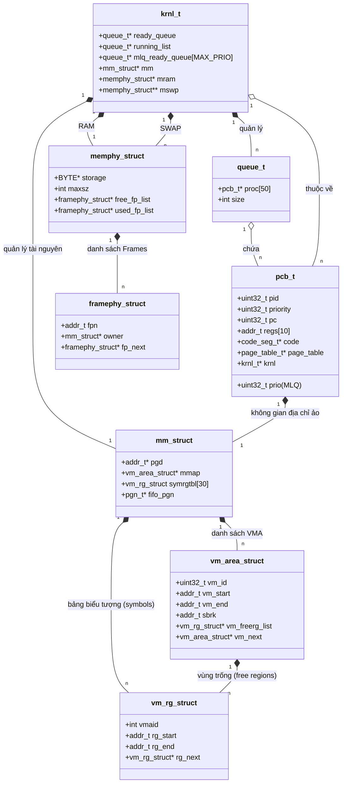

# Tài liệu Kiến trúc Hệ thống & Hướng dẫn Lập lịch MLQ

Tài liệu này cung cấp cái nhìn tổng quan về cấu trúc project OS Simulation và hướng dẫn chi tiết để hiện thực thuật toán lập lịch Multi-level Queue (MLQ).

---

## 1. Phân tích Thành phần Hệ thống

| Module | File (Header/Source) | Struct/Class Chính | Vai trò & Mô tả |
| :--- | :--- | :--- | :--- |
| **Kernel Core** | `os.c`, `timer.c`, `common.h` | `struct krnl_t` | Trung tâm điều phối hệ thống. Quản lý RAM, Swap, hàng đợi lập lịch và các bảng trang hạt nhân. |
| **Lập lịch (Sched)** | `sched.c`, `queue.c`, `queue.h` | `struct queue_t`, `MLQ` | Hiện thực chính sách Multi-level Queue. Quản lý các hàng đợi tiến trình sẵn sàng. |
| **Tiến trình (Proc)** | `loader.c`, `common.h` | `struct pcb_t` | Process Control Block. Lưu giữ toàn bộ thông tin về tiến trình (PID, PC, Bảng trang, Code, Thanh ghi). |
| **Thực thi (CPU)** | `cpu.c`, `cpu.h` | `struct inst_t` | Mô phỏng việc giải mã và thực thi lệnh (CALC, ALLOC, READ, WRITE, SYSCALL). |
| **Bộ nhớ ảo (VM)** | `mm-vm.c`, `os-mm.h`, `mm.h` | `struct mm_struct`, `vm_area_struct`, `vm_rg_struct` | Quản lý không gian địa chỉ ảo, các vùng nhớ (VMA) và các đoạn nhớ (Region). |
| **Bộ nhớ vật lý** | `mm-memphy.c`, `os-mm.h` | `struct memphy_struct`, `framephy_struct` | Mô phỏng RAM và Swap. Quản lý các khung trang vật lý (Frames). |
| **System Calls** | `syscall.c`, `libmem.c`, `sys_mem.c` | `struct sc_regs` | Cầu nối giữa Userspace và Kernelspace. Xử lý các yêu cầu cấp phát, đọc/ghi bộ nhớ. |

---

## 2. Sơ đồ Quan hệ (Class Diagram)

---

## 3. Chính sách Lập lịch Multi-level Queue (MLQ)

### A. Cơ chế hoạt động
Project sử dụng `MAX_PRIO = 140` mức ưu tiên. Mỗi mức ưu tiên có một hàng đợi riêng.

**Cơ chế Slot (Time Quantum theo Priority):**
Hệ thống sử dụng mảng `static int slot[MAX_PRIO]` để cấp phát lượt chạy cho mỗi mức ưu tiên trong một chu kỳ:
*   Khởi tạo: `slot[i] = MAX_PRIO - i`.
*   Ý nghĩa: Mức ưu tiên càng cao (số `i` càng nhỏ) thì càng nhận được nhiều slot (thời gian chạy) hơn trong một vòng tuần hoàn.

### B. Logic Lập lịch (`get_mlq_proc`)
1.  **Duyệt tìm**: Chạy vòng lặp từ `prio = 0` đến 139.
2.  **Lấy tiến trình**: Nếu hàng đợi `mlq_ready_queue[prio]` có tiến trình VÀ `slot[prio] > 0`:
    *   Lấy tiến trình ra khỏi hàng đợi (FIFO).
    *   Giảm `slot[prio]` đi 1.
    *   Trả về tiến trình cho CPU.
3.  **Hết chu kỳ (Reset)**: Nếu duyệt qua tất cả hàng đợi mà không lấy được tiến trình nào (do tất cả hàng đợi có tiến trình đều đã dùng hết slot):
    *   Nếu hệ thống thực sự hết tiến trình (kiểm tra `queue_empty()`): Trả về `NULL`.
    *   Nếu vẫn còn tiến trình nhưng hết slot: Khởi tạo lại mảng `slot[i] = MAX_PRIO - i` và quay lại bước 1.

---

## 4. Luồng hoạt động chính (Operational Flow)

1.  **Loader (`loader.c`)**: Đọc file mô tả tiến trình, tạo `pcb_t`, gán `prio` và gọi `add_proc()`.
2.  **Timer (`timer.c`)**: Quản lý nhịp thời gian slot. Khi bắt đầu slot mới, nó thông báo cho CPU.
3.  **CPU (`os.c`)**: 
    *   Mỗi CPU là một thread chạy `cpu_routine`.
    *   CPU gọi `get_proc()` để lấy tiến trình từ Scheduler.
    *   Gọi `run(proc)` trong `cpu.c` để thực thi 1 lệnh.
    *   Nếu hết `time_slot`, gọi `put_proc()` để trả tiến trình về hàng đợi.
4.  **Memory (`mm-vm.c` / `libmem.c`)**: Khi CPU chạy lệnh `ALLOC/READ/WRITE`, các hàm này sẽ xử lý ánh xạ địa chỉ ảo sang vật lý, xử lý Page Fault và Swap nếu cần.
